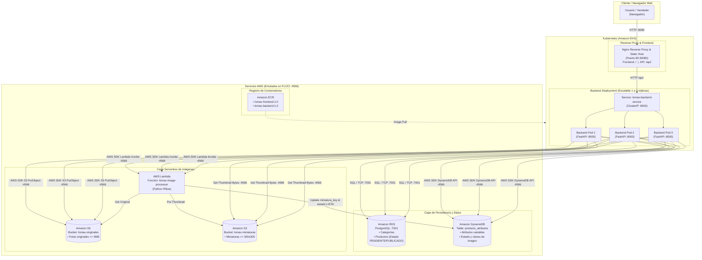

# Etapa 1: Diseño de la Arquitectura de la Solución
**Sistema:** Plataforma de Catálogo y Registro de Productos - Lomax SA  
**Entorno:** Local FLOCI (Emulador AWS) / Docker / Kubernetes

---

## 1. Diagrama de Arquitectura

---

## 2. Descripción de Componentes, Redes y Puertos

| Componente | Rol en la Arquitectura | Protocolo / Puerto | Interconexión |
| :--- | :--- | :--- | :--- |
| **Frontend / Nginx** | Sirve HTML/JS y actúa como Reverse Proxy. Enruta `/` a los estáticos y `/api/` al backend. | HTTP / 80 (NodePort 30080, Docker 8080) | Expuesto al usuario; envía peticiones al backend. |
| **Backend API (FastAPI)** | API RESTful con lógica de negocio, validaciones transaccionales y orquestación AWS. | HTTP / 8000 | Conectado a RDS, DynamoDB, S3 y Lambda. |
| **Amazon RDS (PostgreSQL)** | Almacén relacional con integridad referencial y restricciones ACID. | TCP PostgreSQL / 7001 | Exclusivamente consumido por el Backend. |
| **Amazon DynamoDB** | Almacén NoSQL de atributos flexibles y metadatos de imágenes. | HTTPS/REST / 4566 | Consumido por Backend y actualizado por Lambda. |
| **Amazon S3** | Buckets para fotos originales y miniaturas optimizadas. | HTTPS/REST / 4566 | Subidas desde Backend; procesamiento por Lambda. |
| **AWS Lambda** | Procesamiento síncrono Serverless de redimensionamiento proporcional. | Invocation API / 4566 | Invocado por Backend; interactúa con S3 y DynamoDB. |
| **Amazon ECR** | Registro de imágenes Docker versionadas por tag y sha256 digest. | Docker Registry v2 / 4566 & 5100 | Provee imágenes a Docker Compose y EKS. |
| **Amazon EKS** | Orquestador Kubernetes de pods con alta disponibilidad y autorecuperación. | Kubernetes API / 6500 | Ejecuta pods de backend y frontend en red interna `10.42.0.0/16`. |

---

## 3. Flujo Integral de Registro y Publicación
1. **Paso 1 (Registro Base):** El cliente envía `POST /productos` con datos básicos y atributos variables JSON.
2. **Paso 2 (Persistencia Inicial):** La API valida restricciones, inserta en RDS como estado `PENDIENTE`, y almacena los atributos en DynamoDB vinculados al mismo `producto_id`.
3. **Paso 3 (Carga de Imagen):** El cliente envía la foto a `POST /productos/{id}/imagen`.
4. **Paso 4 (Almacenamiento e Invocación):** La API valida formato (JPEG/PNG) y peso (<=5MB), guarda el original en S3 `lomax-originales/{id}/imagen.ext`, e invoca Lambda síncronamente.
5. **Paso 5 (Procesamiento Serverless):** Lambda valida dimensiones, crea una miniatura de hasta 300x300 manteniendo proporción, la guarda en S3 `lomax-miniaturas/{id}/imagen-thumb.ext` y actualiza DynamoDB con `estado_imagen = LISTA`.
6. **Paso 6 (Publicación Confirmada):** Solo tras confirmar la miniatura en S3 y los atributos en DynamoDB, la API cambia el estado en RDS a `PUBLICADO`.
7. **Paso 7 (Catálogo Unificado):** El endpoint `GET /productos` combina la información de RDS y DynamoDB, sirviendo el catálogo completo con imágenes optimizadas.
